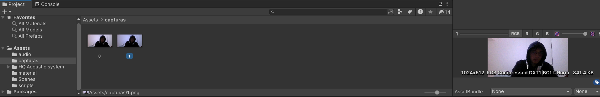

# II_microycam

## Ejercicio 1
Simplemente al detectar la colisión llamamos a audiosource.Play()
(Ver ej1.mp4)

## Ejercicio 2
Iniciamos la captura del microfono en start(), si se pulsa la S se para con Microphone.End(null), si se 
pulsa la R se reproduce el audio grabado
(Ver grabarvoz.mp4)

## Ejercicio 3->5
Ejemplo de la funcionalidad de grabar la camara del pc y mostrarla:

Ejemplo de un par de capturas realizadas

